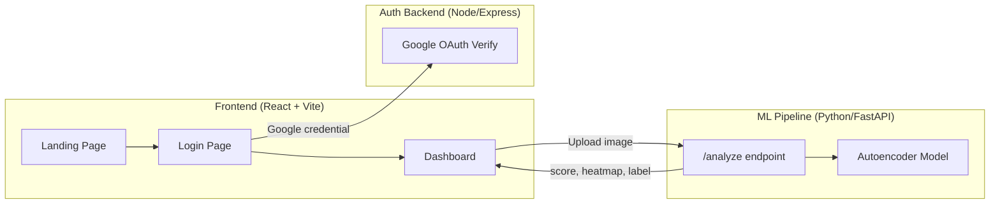

# PDNC_PBL — Project Overview

**Satellite Anomaly Detection Platform** — A full-stack web application that uses Convolutional Autoencoders to detect anomalies (deforestation, illegal construction, oil spills, etc.) in satellite imagery.

> **Repo:** [github.com/smrutiparhi/PDNC_PBL](https://github.com/smrutiparhi/PDNC_PBL)

---

## Architecture



| Layer | Tech Stack | Port |
|---|---|---|
| **Frontend** | React 19, TypeScript, Vite 6, Tailwind CSS 4, Motion, Recharts, Lucide Icons | `3000` |
| **Auth Backend** | Node.js, Express 5, Google Auth Library, JWT | `5000` |
| **ML API** | Python, FastAPI, PyTorch, OpenCV, Pillow | `8000` |

---

## File Structure

```text
PDNC_PBL/
├─ src/                          # React frontend source
│  ├─ App.tsx                    # Router: /, /login, /dashboard (protected)
│  ├─ main.tsx                   # Entry point
│  ├─ index.css                  # Global styles
│  ├─ utils/cn.ts                # Tailwind merge utility
│  ├─ components/
│  │  ├─ landing/                # Landing page sections
│  │  │  ├─ Navbar.tsx
│  │  │  ├─ Hero.tsx             # Hero section with satellite animation
│  │  │  ├─ FeaturesBento.tsx
│  │  │  ├─ HowItWorks.tsx
│  │  │  ├─ DemoShowcase.tsx
│  │  │  ├─ PricingCards.tsx
│  │  │  └─ Footer.tsx
│  │  └─ dashboard/              # Dashboard components
│  │     ├─ Sidebar.tsx
│  │     ├─ ImageDropzone.tsx    # Image upload for analysis
│  │     ├─ HeatmapViewer.tsx   # Anomaly heatmap display
│  │     ├─ MetricsPanel.tsx    # Score & metrics display
│  │     ├─ ModelRegistry.tsx
│  │     ├─ ScanHistory.tsx
│  │     ├─ SystemSettings.tsx
│  │     └─ TerminalLogs.tsx
│  └─ pages/
│     ├─ Landing.tsx
│     ├─ Login.tsx               # Google SSO + local mock login
│     └─ Dashboard.tsx           # Main analysis workspace
│
├─ backend/                      # Auth microservice
│  ├─ server.js                  # Express server — POST /auth/google
│  └─ package.json
│
├─ satellite_anomaly_detection/  # ML pipeline
│  ├─ src/
│  │  ├─ model.py               # Convolutional Autoencoder architecture
│  │  ├─ dataset.py             # Dataloader & transforms
│  │  ├─ train.py               # Training loop (MSE loss)
│  │  ├─ detect.py              # Anomaly detection & heatmap generation
│  │  ├─ evaluate.py            # ROC, Precision/Recall, Confusion Matrix
│  │  └─ utils.py               # Helper utilities
│  ├─ api.py                    # FastAPI server — POST /analyze, GET /health
│  ├─ app.py                    # Streamlit interactive app
│  ├─ data/                     # Normal/ & Anomaly/ satellite images
│  ├─ models/                   # Saved model checkpoints
│  └─ requirements.txt
│
├─ index.html                    # Vite HTML entry
├─ vite.config.ts
├─ tsconfig.json
├─ package.json
└─ .env / .env.example           # GEMINI_API_KEY, Google OAuth config
```

---

## Key Features

### Landing Page
- **Hero** with animated satellite background & Sci-Fi aesthetic
- **Features Bento** grid showcasing capabilities
- **How It Works** step-by-step guide
- **Demo Showcase** section
- **Pricing Cards** tiers
- Lazy-loaded images with skeleton placeholders

### Authentication
- **Google SSO** via `@react-oauth/google` → verified by backend → JWT issued
- **Local mock login** fallback for development
- **Protected routes** — dashboard requires auth in `localStorage`

### Dashboard
- **Image Upload** — drag & drop satellite images
- **Real-time Analysis** — images sent to FastAPI ML backend
- **Heatmap Viewer** — visualizes anomaly regions with dynamic loss graph
- **Metrics Panel** — anomaly score, label, precision/recall
- **Model Registry**, **Scan History**, **Terminal Logs**, **System Settings**

### ML Pipeline
- **Convolutional Autoencoder** trained only on "Normal" satellite images
- Anomalies produce high MSE reconstruction error → flagged & heat-mapped
- Evaluation: ROC-AUC, Precision/Recall, Confusion Matrix
- Standalone Streamlit app for quick testing

---

## How to Run

```bash
# 1. Frontend
npm install && npm run dev          # → localhost:3000

# 2. Auth Backend
cd backend && npm install && npm start  # → localhost:5000

# 3. ML API
cd satellite_anomaly_detection
pip install -r requirements.txt
python api.py                        # → localhost:8000
```

Set env vars in `.env`: `GEMINI_API_KEY`, `VITE_GOOGLE_CLIENT_ID`, `GOOGLE_CLIENT_ID`.
